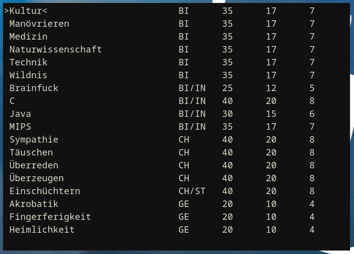

# BarnabasBox

**BarnabasBox** is a bare-minimum TUI library. It is written with common Linux distributions in mind and while it may work on other operating systems, there is no guarantee for this.



## But why?

Because I can. Also, statically linked binaries using [Termbox2](https://github.com/termbox/termbox2) are too large (a.k.a. bloat).

## What about the name?

> […] And Joses, who by the apostles was surnamed Barnabas, (which is, being interpreted, The son of consolation,) a Levite, and of the country of Cyprus […]

*Acts 4:36*

Barnabas is a cool name, period. Also, I didn't come up with a better name when I named my files.

## Dependencies

- libc (including an implementation of termios.h and stdio.h)
- terminal supporting ECMA-48
- C compiler (i.e. gcc or [cproc](https://github.com/michaelforney/cproc))

## Build

Type `make` if you have make installed. Please note that the default compiler in the Makefile is `cproc`. If you prefer another compiler, edit the Makefile please.

Otherwise, you can compile each file manually with `CC -c -o name-of-file.o name-of-file.c`, where `CC` is your C compiler and `name-of-file` the file you want to compile.

## Usage

```C
#include "barnabas.h"

int main() {
	// Initialize TUI
	binit();
	
	fputs("Hello, World!", stdout);
	fgetc(stdin);

	// Clear screen
	bwash();
	
	// Get terminal size
	int row, col;
	bsize(&row, &col);

	// Input prompt
	char str[64];
	bread(str, 64, "Type something here: ");
	fputs(str, stdout);

	fgetc(stdin);
	
	// Deinitialize TUI
	bquit();
}
```

